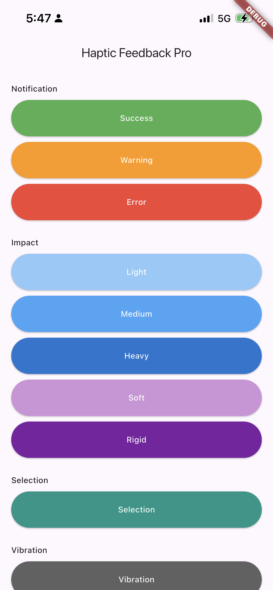

# haptic_feedback_pro ⚡

A Flutter plugin for triggering rich haptic feedback on iOS and Android.

Supports all native haptic types — impact, notification, selection, and full vibration. 🎯

<p align="center">
  
</p>

---

## 📱 Platform Support

| Android | iOS |
|:-------:|:---:|
| ✅      | ✅  |

---

## 🚀 Installation

Add to your `pubspec.yaml`:

```yaml
dependencies:
  haptic_feedback_pro: ^1.0.0
```

Then run:

```bash
flutter pub get
```

---

## 🛠️ Usage

```dart
import 'package:haptic_feedback_pro/haptic_feedback_pro.dart';

final haptic = HapticFeedbackPro();

// Trigger any feedback type
await haptic.trigger(FeedbackType.success);
await haptic.trigger(FeedbackType.heavy);
await haptic.trigger(FeedbackType.vibration);
```

---

## 🎛️ Feedback Types

| Type | Description | iOS | Android |
|------|-------------|-----|---------|
| `FeedbackType.light` | 🪶 Light impact | `UIImpactFeedbackGenerator(.light)` | `EFFECT_TICK` |
| `FeedbackType.medium` | 👆 Medium impact | `UIImpactFeedbackGenerator(.medium)` | `EFFECT_CLICK` |
| `FeedbackType.heavy` | 💪 Heavy impact | `UIImpactFeedbackGenerator(.heavy)` | `EFFECT_HEAVY_CLICK` |
| `FeedbackType.soft` | 🫧 Soft impact *(iOS 13+)* | `UIImpactFeedbackGenerator(.soft)` | `EFFECT_TICK` |
| `FeedbackType.rigid` | 🪨 Rigid impact *(iOS 13+)* | `UIImpactFeedbackGenerator(.rigid)` | `EFFECT_HEAVY_CLICK` |
| `FeedbackType.success` | ✅ Success notification | `UINotificationFeedbackGenerator(.success)` | `EFFECT_DOUBLE_CLICK` |
| `FeedbackType.warning` | ⚠️ Warning notification | `UINotificationFeedbackGenerator(.warning)` | Waveform pattern |
| `FeedbackType.error` | ❌ Error notification | `UINotificationFeedbackGenerator(.error)` | Waveform pattern |
| `FeedbackType.selection` | 🔘 Selection change | `UISelectionFeedbackGenerator` | `EFFECT_TICK` |
| `FeedbackType.vibration` | 📳 Full device vibration | `AudioServicesPlaySystemSound` | `createOneShot(400ms)` |

> ⚠️ **Note:** Android predefined effects require API 29+. Devices below API 26 will skip silently.

---

## ⚙️ Requirements

- 🍎 **iOS:** 10.0+
- 🤖 **Android:** API 16+ (haptic effects require API 26+)
- 💙 **Flutter:** 3.0+

---

## 📄 License

MIT
